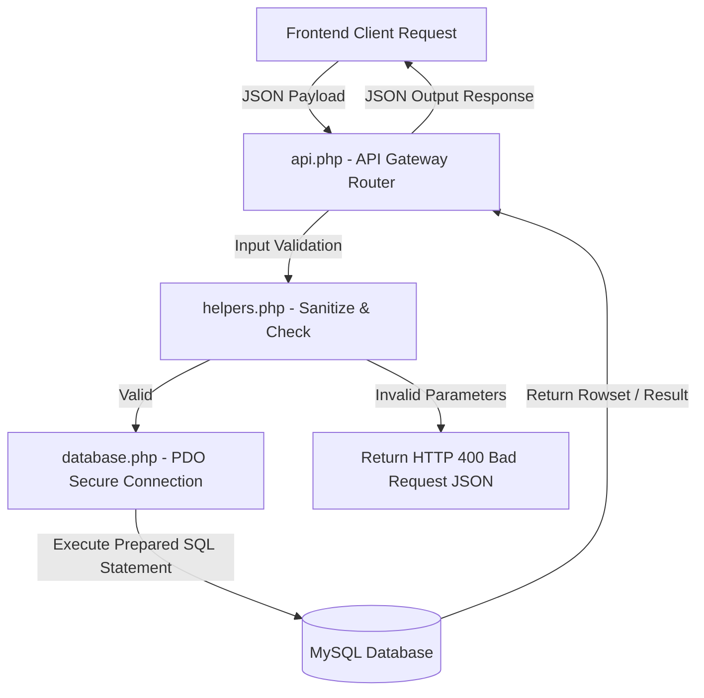

# Mobadratna Core Engine: Secure PHP RESTful API & Administrative Engine

<div align="center">
  
</div>

<div align="center">
    
</div>

خادم **مبادرتنا البرمجي** هو محرك سحابي متكامل يعتمد على لغة PHP وقاعدة بيانات MySQL لمعالجة طلبات التطوع وإدارة برامج الأنشطة وحسابات المسؤولين وتوثيق البيانات الإحصائية للتقارير الجامعية.

This repository contains the backend RESTful API services, security filters, database schema migrations, and administration dashboard controllers for the **Mobadratna Ecosystem**.

---

## 🧬 Backend Services & API Handlers

The backend engine provides core endpoints and files:

1.  **API Gateway Router (`api.php`)**: Unified routing processor handling requests for initiatives, volunteer submissions, status approvals, and database updates.
2.  **Database Connection Config (`config.php`, `database.php`)**: Secure PDO initialization parameters and connection pools.
3.  **Security Helpers (`helpers.php`)**: Validation layers providing clean database input filters and XSS/SQL Injection protection.
4.  **Database Schema Migration (`database.sql`)**: Structural tables mapping user credentials, initiatives list, and voluntary enrollment records.
5.  **Administrative Panels (`admin/`)**: Sub-folders managing administrative tasks like initiative approvals, stats tracking, and user authorizations.

---

## 🧬 API Data & Security Flow

The REST engine handles secure request lifecycles:



---

## 🛠️ Technology Stack & Security Features

*   **Runtime Backend**: Written in clean raw **PHP 8.0+** to ensure maximum execution speeds.
*   **Relational Storage**: Powered by **MySQL** mapping relationships between initiatives and volunteers.
*   **Database Access Security**: Implemented strictly using **PHP Data Objects (PDO)** prepared statements to prevent SQL Injection exploits.
*   **HTTP Protocol Access**: CORS headers and JSON response formatting for integration with static clients.

---

## 📂 Repository Module Layout

```text
mobadratna-core-engine/
├── admin/               # Administrative backend managers and dashboards
├── uploads/             # Server directory storing poster attachments
├── api.php              # API global router endpoint
├── config.php           # Global configuration values
├── database.php         # PDO database connection pool
├── database.sql         # Database schema structure migrations script
└── helpers.php          # Validation, session, and sanitization utilities
```

---

## ⚡ Local Setup & Execution

### 📋 Prerequisites
* Local Web server running PHP 8.0+ and MySQL (e.g. XAMPP, Laragon, or Docker)

### ⚙️ Quick Start Steps
```bash
# 1. Clone the backend repository inside Apache root folder (e.g. htdocs)
git clone https://github.com/Mobadratna-Org/mobadratna-core-engine.git
cd mobadratna-core-engine

# 2. Setup Database
# Create database named 'mobadratna' in MySQL phpMyAdmin
# Import 'database.sql' schema script

# 3. Configure Database connection
# Edit config.php and set database credentials (db_user, db_pass, host)

# 4. Run Apache & Test API endpoints
# Query the API: http://localhost/mobadratna-core-engine/api.php
```

---

## 📄 License
Licensed under the **MIT License**.
